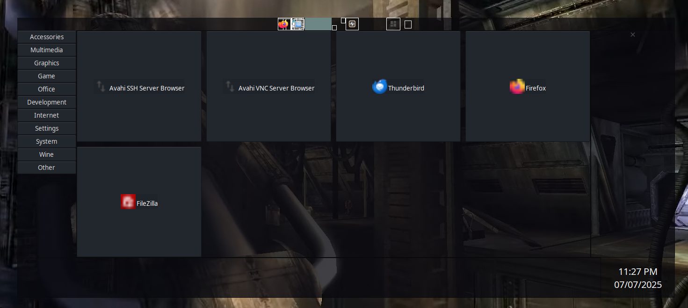
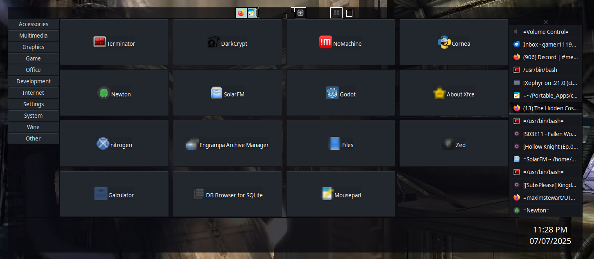

# UTop
UTop is a Gtk+ Python dynamically toggleable desktop.

# Notes
<b>Still Work in  progress! Use at own risk!</b>

<h6>Install Setup</h6>
```
sudo apt-get install python3.8 wget python3-setproctitle python3-gi python3-pyxdg
```

# TODO
...

# Images


